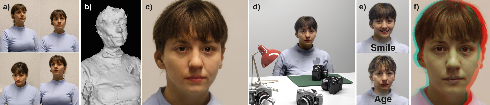
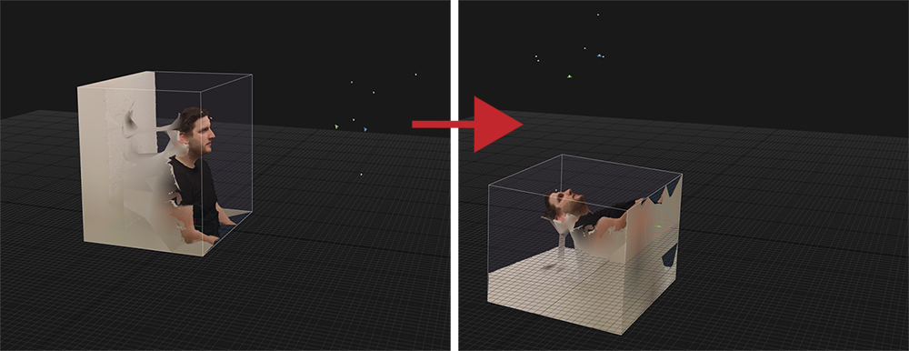
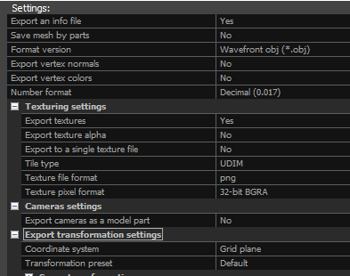
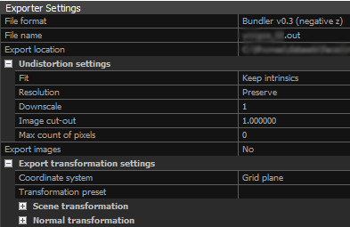
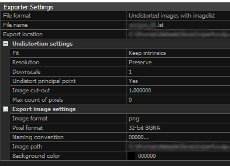
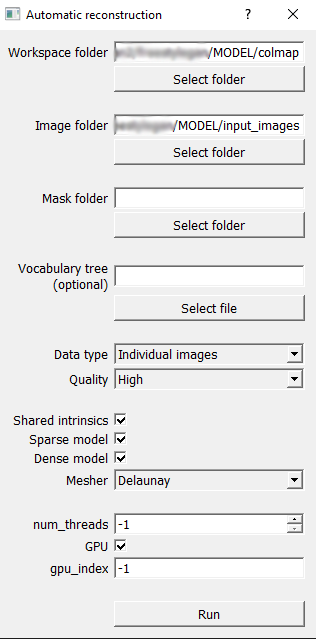

# FreeStyleGAN &mdash; Official Implementation



**FreeStyleGAN: Free-view Editable Portrait Rendering with the Camera Manifold**<br>
Thomas Leimkühler, George Drettakis<br>

Project Webpage: https://repo-sam.inria.fr/fungraph/freestylegan/

Abstract: *Current Generative Adversarial Networks (GANs) produce photorealistic renderings of portrait images. Embedding real images into the latent space of such models enables high-level image editing. While recent methods provide considerable semantic control over the (re-)generated images, they can only generate a limited set of viewpoints and cannot explicitly control the camera. Such 3D camera control is required for 3D virtual and mixed reality applications. In our solution, we use a few images of a face to perform 3D reconstruction, and we introduce the notion of the GAN camera manifold, the key element allowing us to precisely define the range of images that the GAN can reproduce in a stable manner. We train a small face-specific neural implicit representation network to map a captured face to this manifold and complement it with a warping scheme to obtain free-viewpoint novel-view synthesis. We show how our approach – due to its precise camera control – enables the integration of a pre-trained StyleGAN into standard 3D rendering pipelines, allowing e.g., stereo rendering or consistent insertion of faces in synthetic 3D environments. Our solution proposes the first truly free-viewpoint rendering of realistic faces at interactive rates, using only a small number of casual photos as input, while simultaneously allowing semantic editing capabilities, such as facial expression or lighting changes.*

## News

This codebase has been upgraded and now also contains 
* COLMAP support for camera calibration and geometry reconstruction,
* OpenGL-based training on headless machines,
* Support for Windows and Linux.


## Requirements

* FreeStyleGAN is an addon to the [official StyleGAN2 TensorFlow implementation](https://github.com/NVlabs/stylegan2). All requirements carry over. Additionally, OpenGL support is required.
* For camera calibration and geometry reconstruction, we rely on [RealityCapture](https://www.capturingreality.com/) or [COLMAP](https://demuc.de/colmap/). For mesh smoothing, we use [MeshLab](https://www.meshlab.net/).


## Setup

1. Use [Anaconda](https://www.anaconda.com/products/individual#windows) to set up the Python environment:

    ```
    conda create -n "freestylegan" python=3.6
    conda activate freestylegan
    conda install -y numpy tensorflow-gpu=1.14 requests matplotlib opencv scikit-learn
    conda install -c conda-forge -y dlib
    pip install PyWavefront PyOpenGL glfw
    ```
3. Some (optional) parts of the pipeline require PyTorch. A safe way to avoid conflicts is to create a separate PyTorch environment:
    ```
    conda create -n "freestyleganTorch" python=3.6
    conda activate freestyleganTorch
    ```
    Install PyTorch (we have tested with version 1.7.0) following the instructions [here](https://pytorch.org/get-started/locally/). Additional packages:
    ```
    conda install -y requests
    conda install -c 1adrianb -y face_alignment
	pip install opencv-python
    ```
    

    Always use the `freestylegan` environment from step 1, unless a step is marked **[torch]**.
4. Clone the [StyleGAN2 repository](https://github.com/NVlabs/stylegan2) into a local directory `stylegan2` and set up NVCC as described in their documentation (this usually includes updating the `compiler_bindir_search_path` in `stylegan2/dnnlib/tflib/custom_ops.py`). Download the [pretrained FFHQ model](https://nvlabs-fi-cdn.nvidia.com/stylegan2/networks/stylegan2-ffhq-config-f.pkl) (373 MB). Make sure, you can run the generator, e.g., by running
    ```
    python run_generator.py generate-images --network=path/to/stylegan2-ffhq-config-f.pkl --seeds=6600-6610 --truncation-psi=0.5
    ```
    To speed up compilation, you might want to set `do_not_hash_included_headers = True` in `stylegan2/dnnlib/tflib/custom_ops.py`.
5. Clone this FreeStyleGAN repository into the directory `stylegan2/freestylegan`.
6. You can test the OpenGL setup by running
      ```
      python freestylegan/opengl_test.py
      ```
    If the test is successful, you will see the teaser figure appearing in a window.
7. The pre-processing pipeline requires pre-trained models to be downloaded into `stylegan2/freestylegan/data/networks/`:
    - [VGG-Face](https://www.robots.ox.ac.uk/~vgg/software/vgg_face/) for extracting facial recognition features: [vgg-face.mat](https://www.vlfeat.org/matconvnet/models/vgg-face.mat) (1 GB)
    - [MODNet](https://github.com/ZHKKKe/MODNet) for obtaining foreground mattes: modnet_photographic_portrait_matting.ckpt from [this Google drive](https://drive.google.com/drive/folders/1umYmlCulvIFNaqPjwod1SayFmSRHziyR) (25 MB)
    - [dlib](http://dlib.net/) facial landmark detector: [shape_predictor_68_face_landmarks.dat](http://dlib.net/files/shape_predictor_68_face_landmarks.dat.bz2) (97 MB). Unzip the file after downloading.
8. Extract the generator network from the StyleGAN2 FFHQ model to avoid loading the discriminator everytime the application starts. The following command extracts the generator and saves it into the networks directory:
    ```
    python freestylegan/extract_generator.py path/to/stylegan2-ffhq-config-f.pkl
    ```

## Capture

Capture a multi-view dataset as described in Section 1 of our [supplemental document](https://www-sop.inria.fr/reves/Basilic/2021/LD21/freestylegan_supplemental.pdf).

## Pre-processing

1. **Remove all Exif data** from the input images (e.g., using [this tool](http://www.exifpurge.com/)). This prevents auto-rotation features from creating problems in the pipeline. Make sure that after this step all images are still upright - rotate images if necessary. All subsequent steps assume that data will be saved into a folder `MODEL`.
2. You can use either [RealityCapture](https://www.capturingreality.com/) (recommended) or [COLMAP](https://demuc.de/colmap/) for **calibration and reconstruction of the scene**. 
   - Using **RealityCapture**:
       - Drag and drop the images from step 1 into the application.
       - In many cases, it is sufficient to rely on the fully automatic pipeline: Just click on `Workflow → 2. Process → Start` to obtain camera calibrations and a textured mesh.
       - Using `Reconstruction → Model Alignment → Set Ground Plane`, tilt the entire scene backwards such that the head lies flat on the grid looking up: 
    
         
       - Using `Workflow → 3. Export → Model`, export the geometry. Save to folder `MODEL/realitycapture/model/` with the following settings: 
    
         
       - Using `Workflow → 3. Export → Registration`, export cameras, save to folder `MODEL/realitycapture/registration/` with the following settings: 
    
           
       - Using `Workflow → 3. Export → Registration`, export undistorted images, save to folder `MODEL/realitycapture/registration/` with the following settings: 
    
         
   - Using **COLMAP** (tested with v3.6-cuda):
     - Choose `Automatic Reconstruction` under the `Reconstruction` option in the menu bar.
     - Create a folder named `colmap` in your `MODEL` directory and set this folder as your `Workspace folder`. As `Image folder` set the location of your images. Set the remaining options as depicted in the screenshot and press `Run`.
   
       
3. **Smooth the mesh** in [MeshLab](https://www.meshlab.net/). 
   - Using data from **RealityCapture**: Open the OBJ file in `MODEL/realitycapture/model` in MeshLab and run `Filters → Smoothing, Fairing, and Deformation → Laplacian smooth (Surface preserving)` with `Max normal dev=100` and `Iterations=25`. Export the mesh (`File → Export Mesh`) as OBJ with colors and texture coordinates, but without normals. Make sure that the new mesh is the only OBJ file in `MODEL/realitycapture/model`.
   - Using data from **COLMAP**: Open `MODEL/colmap/dense/0/meshed_delaunay.ply` in MeshLab and run `Filters → Smoothing, Fairing, and Deformation → Laplacian Smooth (surface preserving)` with `Max normal dev=20` and `Iterations=10`. Export the mesh (`File → Export Mesh`) as ***OBJ*** in the same directory and make sure that the new mesh is the only OBJ file in `MODEL/colmap/dense/0`.
4. **[torch]** Optional, but recommended: **Blur the background of the images**. 
    ```
    python preprocessing/blur/blur_background.py path/to/MODEL <output matte>
    ```
    - `output matte`: Set to 1 if you want to also export the foreground matte, else set to 0.
5. **Align mesh and images**. This produces a new folder `MODEL/freestylegan` with aligned mesh, original cameras, aligned images, model matrix, VGG-face features, mouth position, and the indices of all images corresponding to valid camera manifold coordinates. In case automatic face feature detection fails (this sometimes happens for individual images), you will be prompted to click on the images appearing - in the following order: 1. screen-left eye, 2. screen-right eye, 3. mouth center. If not all of the above features are visible, just press any key. This image will then be ignored in all later processing steps. </br>
Optionally, you can exclude images from the alignment procedure manually, by creating a text file and listing all image indices (zero-based, one index per line). If you have used RealityCapture in the prior steps, create the text file in `MODEL/realitycapture/registration/blacklist.txt`, and if you have used COLMAP, create the text file in `MODEL/colmap/dense/0/image/blacklist.txt`. 
    ```
    python preprocessing/alignment/face_align.py path/to/MODEL <use blurred images>
    ```
    - `use blurred images`: Set to 1 if you want to use the blurred images from the previous step, else set to 0.
    
    ***Optional***: Create a blacklist for images you want to exclude from any further consideration *after* this step. For example, this is useful for images where the face is partially cropped. Simply create a file `MODEL/freestylegan/blacklist.txt` and list all image indices (zero-based, one index per line) you want to exclude.
7. **Train implicit latent representation network**. The two training stages require separate calls:
    ```
    python preprocessing/training/training_stage1.py --data-dir=path/to/MODEL
    python preprocessing/training/training_stage2.py --data-dir=path/to/MODEL
    ```
    You can observe training progress with Tensorboard using the log files in `freestylegan/logs`.

## Interactive Viewer

Once pre-processing has finished, use the interactive viewer to explore editable novel views:

<pre>
python viewer.py <i><b>path_to_MODEL</b></i> [-m/--mode <i><b>render_mode</b></i> ] [-c/--camera <i><b>path_to_cameraFile.out</b></i>] [-o/--output <i><b>desired_output_path</b></i>]
</pre>

`path_to_MODEL` is the only positional argument that must be set. There are several additinal optional arguments:

|Optional Arguments    |Description            |
|----------------------|-----------------------|
|`-m/--mode`         |Specify which render mode you would like to use. By default, it is `FreeStyleGAN`. Valid modes are `{MeshFree, MeshManiFold, ULRFree, ULRManifold, GANManifold, FreeStyleGAN, TopManifoldViz, ParametersManifoldViz}`.
|`-c/--camera`       |By specifying this argument, the viewer is no longer interactive. Instead, the camera path is used to render and save images in the specified render mode. This file should be in standard [Bundler](https://www.cs.cornell.edu/~snavely/bundler/bundler-v0.4-manual.html) (`.out`) format in canonical coordinates (see [Using Cameras](#using-cameras) below).
|`-o/--output`       |Directory where the rendered images should be saved. By default, it is `stylegan2/freestylegan/results/screenshots/`|

The viewer supports multiple rendering and visualization modes, including a textured mesh, unstructured lumigraph rendering, manifold and flow visualizations, on-manifold StyleGAN, and &ndash; of course &ndash; FreeStyleGAN. It also allows to record, play back, and export camera paths (detailed in the [next section](#using-cameras)). Press `h` to see a list of all available options. You might also want to look at the first few lines in the `main()` function of `viewer.py` to access more options.

Further, you can perform [PCA-based semantic edits](https://arxiv.org/abs/2004.02546) by utilizing the slider window. Use the first two sliders to restrict the edits to a range of generator layers, the other sliders directly manipulate the corresponding latent codes.

**Note**: If you used COLMAP for reconstruction, the mesh does not contain texture. Therefore, a solid red texture is shown for the `MeshFree` and `MeshManifold` modes.

## Using Cameras

FreeStyleGAN is fully compatible with complete 3D camera models. For details on how to interactively control the camera in the viewer (including stereo options), press `h`. The default exchange format for cameras is [Bundler](https://www.cs.cornell.edu/~snavely/bundler/bundler-v0.4-manual.html). 

### Recording a Camera Path in the Interactive Viewer

Press `r` to start recording the camera path and press `r` again to stop recording and safe the path to disk. The cameras are stored in the canonical FreeStyleGAN coordinate system.


### Playing a Camera Path and Exporting Images in the Interactive Viewer

Select the rendering/visualization mode to use during the export. Press `p` to select and play a camera path in the canonical coordinate sytem. By default, the images will be stored in `freestylegan/results/screenshots`. Note that you can also provide the `-c/--camera` option to directly render and export a camera path.


### Camera Path Conversion

To convert camera paths from or to the canonical (aligned) FreeStyleGAN coordinate system, use
```
python cameras/path_conversion.py <input_camera_path.out> <modelMatrix.txt> <output_camera_path.out> <resolutionW> <resolutionH> <inverse>
```
- `input_camera_path.out`: The camera path you want to convert.
- `modelMatrix.txt`: The model matrix that was created at step 5 during pre-processing.
- `output_camera_path.out`: The output camera path.
- `resolutionW`: Horizontal output resolution.
- `resolutionH`: Vertical output resolution.
- `inverse`: 1 or 0, depending on if you want to convert to or from canonical coordinates.

Additionally, we provide a script to convert a Bundler camera path into the look-at format:
```
python cameras/path_conversion_lookat.py <input_camera_path.out> <resolutionW> <resolutionH>
```
- `input_camera_path.out`: Path to the camera path you want to convert.
- `resolutionW`: Horizontal output resolution.
- `resolutionH`: Vertical output resolution.

The new camera path will be saved to the same directoy as the input path.

To import a look-at camera path into Autodesk Maya, run the script `cameras/load_path_maya.py` in the Maya script editor.


## Compositing

You can composite a FreeStyleGAN rendering onto a background using [convolution pyramids](https://www.cs.huji.ac.il/labs/cglab/projects/convpyr/) as demonstrated in Fig. 9 of our [paper](https://www-sop.inria.fr/reves/Basilic/2021/LD21/freestylegan_paper.pdf). To do this, first render corresponding camera paths using FreeStyleGAN and the background separately (this likely requires camera path conversions as detailed above). Both image sequences must have the same length and spatial resolution. Put the FreeStyleGAN renderings into a folder `compositing/fg` and the background renderings into a folder `compositing/bg`. Then run
``` 
python compositing.py path/to/compositing
```
The composited results will be saved to `compositing/comp`.

Best results are obtained when the background region is smooth.

## PCA-based Semantic Editing

The semantic editing functionality in the viewer relies on the method of [Härkönen et al.](https://arxiv.org/abs/2004.02546) and requires PCA directions in the StyleGAN latent space. We provide this data for the official [pretrained FFHQ model](https://nvlabs-fi-cdn.nvidia.com/stylegan2/networks/stylegan2-ffhq-config-f.pkl) in `freestylegan/data/pca`. In order to produce this data for other models, you can use this script:
```
python ganspace_pca.py path/to/generator.pkl <components>
```
- `components`: The number of PCA components to obtain.

The result will be stored as a CSV file directly in `freestylegan/data/pca`. To use it in the viewer, simply point to your file in the `main()` function of `viewer.py`.


## Manifold Boundaries

You can analyze the boundaries of the camera manifold and reproduce Fig. 5 of our [paper](https://www-sop.inria.fr/reves/Basilic/2021/LD21/freestylegan_paper.pdf). To do this, first produce a large number (we used 10k) of random StyleGAN images, e.g., using the `run_generator.py` script. Then, using the  **[torch]** environment, run
```
python cameras/manifold_boundary_estimation.py path/to/image_folder
```
All result data and figures will be stored in `path/to/image_folder/boundary_estimation`. To use the obtained boundaries in all scripts of this repository, simply put the file `manifoldClamp.txt` into `freestylegan/data`.

## Acknowledgements

We thank Georgios Kopanas for his help with the code release; Alireza Parchami for implementing the support for COLMAP, a more convenient OpenGL framework, and batch rendering in the viewer; Kai-En Lin for useful suggestions and code snippets.